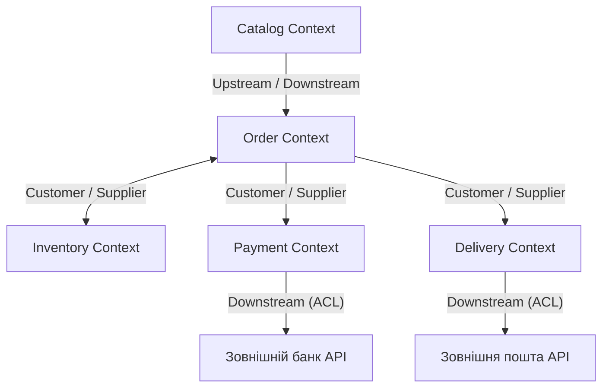

# Архітектурний проєкт: Інтернет-магазин техніки «VoltStore»

## 1. Вибір бізнес-домену

**Предметна область:** E-commerce / Ритейлер споживчої електроніки та гаджетів.  
**Модель бізнесу:** Прямий онлайн-магазин (один продавець, власні склади).

**Основні операційні процеси:**
* Продаж техніки кінцевим покупцям через веб-вітрину.
* Облік залишків на власному складі з обов'язковим резервуванням товарів (запобігання перепродажу / overselling).
* 100% безготівкова онлайн-оплата замовлень через зовнішній платіжний еквайринг.
* Доставка замовлень поштовими операторами («Нова Пошта», Meest) із генерацією товарно-транспортних накладних (ТТН).

---

## 2. Ключові бізнес-сценарії

### Сценарій 1: Оформлення покупки (Happy Path)
1. **Створення замовлення:** Покупець підтверджує кошик. Система фіксує перелік товарів та їхні поточні ціни у вигляді незмінного зрізу.
2. **Резервування товару:** Склад перевіряє залишок та блокує необхідну кількість одиниць техніки під це замовлення.
3. **Оплата:** Платіжний сервіс проводить авторизацію та списання коштів через зовнішній банківський шлюз.
4. **Створення доставки:** Сервіс доставки реєструє посилку в системі поштового оператора та отримує номер ТТН.
5. **Завершення:** Замовлення переходить у стан комплектації на складі, клієнт отримує чек і трек-номер.
* **Результат:** Товар зарезервовано, оплату проведено, накладну ТТН сформовано.

### Сценарій 2: Відхилення замовлення через збій оплати (Rollback)
1. **Ініціація:** Покупець оформлює замовлення, склад успішно ставить товар у резерв.
2. **Збій оплати:** Банк відхиляє транзакцію (недостатньо коштів або ліміт картки).
3. **Зміна статусу:** Замовлення переводиться в статус помилки оплати.
4. **Компенсація:** Система надсилає запит до складу на скасування резерву; заблокований товар повертається у вільний залишок на вітрину.
5. **Фіксація:** Логістична накладна не створюється, покупцю пропонується змінити платіжний засіб.
* **Результат:** Гроші не списані, товар повернуто у вільний продаж, замовлення не оформлено.

### Сценарій 3: Скасування замовлення клієнтом та повернення коштів (Refund)
1. **Запит клієнта:** Покупець надсилає запит на скасування замовлення до його передачі кур'єру.
2. **Перевірка:** Сервіс доставки перевіряє, що вантаж фізично ще не виїхав зі складу.
3. **Анулювання ТТН:** У системі поштового оператора скасовується зареєстрована накладна.
4. **Зняття зі збірки:** Склад скасовує комплектацію та повертає техніку до вільного продажу.
5. **Повернення коштів:** Платіжний сервіс виконує операцію реверсу/повернення грошей на картку покупця.
6. **Завершення:** Замовлення отримує фінальний статус «Скасовано».
* **Результат:** ТТН скасовано, кошти повернуто клієнту, товар повернено на склад.

---

## 3. Виділення Bounded Contexts

Система декомпозована на 5 незалежних обмежених контекстів:

1. **Catalog Context (Каталог):**
   * *Призначення:* Ведення товарного асортименту, категорій, характеристик техніки та публічних цін на вітрині.
2. **Order Context (Замовлення):**
   * *Призначення:* Управління життєвим циклом замовлення, фіксація складу покупки, розрахунок загальної вартості, зміна статусів.
3. **Inventory Context (Склад):**
   * *Призначення:* Кількісний облік фізичних одиниць техніки, резервування залишків під замовлення, облік ваги та габаритів коробок.
4. **Payment Context (Платежі):**
   * *Призначення:* Проведення фінансових транзакцій, взаємодія з банками, обробка списань та повернень (Refund).
5. **Delivery Context (Доставка):**
   * *Призначення:* Організація відправлень, взаємодія з API поштових служб, формування ТТН, трекінг посилок.

---

## 4. Ізоляція даних та Domain Snapshots

### 4.1. Власні сутності доменів

* **Catalog:**
  * `Product`: `id`, `sku`, `title`, `description`, `category`, `price`, `specs`.
* **Inventory:**
  * `StockItem`: `id`, `sku`, `availableQuantity`, `reservedQuantity`, `weightGrams`, `dimensions`.
  * `StockReservation`: `id`, `orderId`, `sku`, `quantity`, `status`, `expiresAt`.
* **Order:**
  * `Order`: `id`, `customerId`, `status`, `totalAmount`, `items` (List<OrderItemSnapshot>), `deliveryInfo` (DeliverySnapshot), `createdAt`.
* **Payment:**
  * `PaymentTransaction`: `id`, `orderId`, `amount`, `currency`, `status`, `externalTransactionId`.
* **Delivery:**
  * `Consignment`: `id`, `orderId`, `carrier`, `waybillNumber`, `status`, `parcelParams` (ParcelSnapshot), `recipient` (RecipientSnapshot).

### 4.2. Точки збереження зрізів (Domain Snapshots)

1. **`OrderItemSnapshot` (у домені Order):**
   * *Поля:* `sku`, `title`, `priceAtPurchase`, `quantity`.
   * *Призначення:* Фіксує назву та ціну товару на момент натискання кнопки «Купити». Якщо менеджер завтра змінить ціну в каталозі, сума вже оформленого замовлення не зміниться.
2. **`DeliverySnapshot` (у домені Order та Delivery):**
   * *Поля:* `recipientName`, `phone`, `city`, `warehouseAddress`.
   * *Призначення:* Фіксує дані отримувача та відділення доставки на момент оформлення. Зміна профілю користувача згодом не вплине на поточну доставку.
3. **`ParcelSnapshot` (у домені Delivery):**
   * *Поля:* `weight`, `dimensions`, `declaredValue`.
   * *Призначення:* Фіксує параметри вантажу для розрахунку вартості та страхування ТТН на момент звернення до пошти.

---

## 5. Матриця зв'язків (Context Map)

### 5.1. Схема контекстів (Context Map)

### 5.2. Ролі взаємодії між доменами

| Взаємодія | Ролі сторін (U / D) | Шаблон зв'язку | Опис взаємодії |
| :--- | :--- | :--- | :--- |
| **Catalog $\to$ Order** | Catalog: **Upstream** Order: **Downstream** | Upstream / Downstream | Order запитує інформацію про товари та ціни з каталогу. Каталог диктує структуру товарних даних. |
| **Inventory $\leftrightarrow$ Order** | Inventory: **Upstream (Supplier)** Order: **Downstream (Customer)** | Customer / Supplier | Order формує вимоги до інтерфейсу складу (блокування залишку за SKU, зняття резерву). Склад реалізує API під потреби замовлення. |
| **Order $\to$ Payment** | Order: **Upstream** Payment: **Downstream** | Customer / Supplier | Order ініціює проведення платежу або повернення коштів, передаючи ідентифікатор замовлення та суму. |
| **Payment $\to$ Банк** | Банк: **Upstream** Payment: **Downstream** | ACL (Anticorruption Layer) | Payment адаптує зовнішні відповіді банку під власну модель транзакцій. |
| **Order $\to$ Delivery** | Order: **Upstream** Delivery: **Downstream** | Customer / Supplier | Після оплати Order ініціює створення відправлення в Delivery, передаючи параметри замовлення. |
| **Delivery $\to$ Пошта** | Пошта: **Upstream** Delivery: **Downstream** | ACL (Anticorruption Layer) | Delivery транслює параметри вантажу у формат запитів поштового оператора («Нова Пошта») та повертає згенерований номер ТТН. |

### 5.3. Призначення антикорупційних шарів (ACL)

* **Payment ACL:** Ізолює внутрішню доменну модель оплат від специфічних протоколів конкретного банку чи платіжного шлюзу. Конвертує сторонні статуси та коди помилок у внутрішній статус `PaymentTransaction`.
* **Delivery ACL:** Ізолює логістичну модель від API перевізників. Транслює внутрішній `ParcelSnapshot` у специфічні поля накладної поштового оператора і витягує номер ТТН. Заміна чи додавання перевізника не змінює логіку сервісу доставки.
