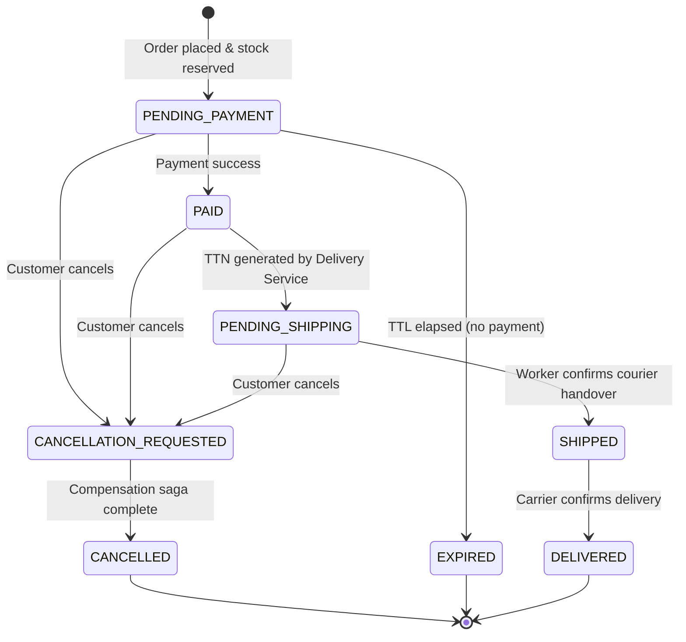

# Order State Machine

> Derived from scenario writing and design discussions.
> This is the authoritative reference for Order lifecycle states and transitions in Order Service.

---

## States

| State | Meaning |
|-------|---------|
| `PENDING_PAYMENT` | Order created, stock reserved. Waiting for customer to complete payment within the TTL window. |
| `PAID` | Payment confirmed. Fulfillment started; TTN generation in progress by Delivery Service. |
| `PENDING_SHIPPING` | TTN successfully generated. Order is ready for courier handover by the inventory worker. |
| `SHIPPED` | Inventory worker confirmed parcel handover to carrier. Customer self-service cancellation locked. |
| `DELIVERED` | Carrier confirmed delivery. Terminal state. |
| `CANCELLATION_REQUESTED` | Customer initiated cancellation. Compensation saga is in progress. Blocks concurrent operations. |
| `CANCELLED` | Cancellation saga completed. Stock released, TTN cancelled (if existed), refund initiated. Terminal state. |
| `EXPIRED` | Payment TTL elapsed with no successful payment. Stock released automatically. No refund. Terminal state. |

---

## State Diagram

---

## Transitions

| From | To | Trigger | Mechanism |
|------|----|---------|-----------|
| *(new)* | `PENDING_PAYMENT` | Customer submits order form; stock atomically reserved | Sync — Order Service creates order and returns `orderId` |
| `PENDING_PAYMENT` | `PAID` | Payment gateway confirms charge | Sync — Order Service validates state, calls Payment Service, handles result directly |
| `PENDING_PAYMENT` | `EXPIRED` | Payment TTL elapsed | Order Service background detection; releases reservation via sync call to Inventory Service |
| `PENDING_PAYMENT` | `CANCELLATION_REQUESTED` | Customer cancels (no payment made yet) | Sync — customer API call to Order Service |
| `PAID` | `PENDING_SHIPPING` | Delivery Service successfully registers TTN with carrier | Async — Delivery Service publishes `TTNGenerated(orderId)`; Order Service consumes and transitions |
| `PAID` | `CANCELLATION_REQUESTED` | Customer cancels (payment made, refund required) | Sync — customer API call to Order Service |
| `PENDING_SHIPPING` | `SHIPPED` | Inventory worker confirms courier handover | Sync — worker API call to Order Service |
| `PENDING_SHIPPING` | `CANCELLATION_REQUESTED` | Customer cancels before handover | Sync — customer API call to Order Service |
| `SHIPPED` | `DELIVERED` | Carrier confirms delivery | Async — Delivery Service receives carrier webhook, publishes `OrderDelivered(orderId)`; Order Service consumes |
| `CANCELLATION_REQUESTED` | `CANCELLED` | Compensation saga completes all steps | Saga coordinator marks order cancelled after all compensation steps succeed |

---

## Cancellation Scope

Customer self-service cancellation is permitted from: `PENDING_PAYMENT`, `PAID`, `PENDING_SHIPPING`.

Cancellation is **locked** once the order reaches `SHIPPED`.

The compensation saga adapts to what needs to be undone:

| Cancelled from | Release stock | Cancel TTN | Refund |
|---------------|--------------|-----------|--------|
| `PENDING_PAYMENT` | ✅ | ❌ (none generated) | ❌ (not charged) |
| `PAID` | ✅ | ⚠️ (cancel if generated) | ✅ |
| `PENDING_SHIPPING` | ✅ | ✅ | ✅ |

---

## Notes

- **`CANCELLATION_REQUESTED`** acts as an idempotency guard — a second cancellation request on an order already in this state is rejected immediately.
- **`EXPIRED`** and **`CANCELLED`** are distinct terminal states with different semantics: `EXPIRED` implies no payment was made and no refund is owed; `CANCELLED` implies a paid order was deliberately reversed.
- **TTL expiry** is detected by Order Service (mechanism TBD: scheduled polling or delayed broker message). It does **not** go through `CANCELLATION_REQUESTED` — it is a system-initiated transition, not a customer action.
- **Delivery status** (`TTN_PENDING`, `TTN_FAILED`, `TTN_GENERATED`) is internal to Delivery Service and is **not** mirrored on the Order entity. For the fulfillment queue, Order Service makes a single sync batch request to Delivery Service to fetch delivery statuses for all relevant orders.
